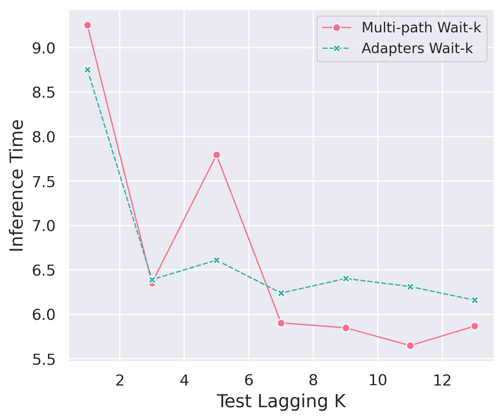

#### Inference Time
We show the inference time (averaged over 5 runs) on the test set as a function of the test lagging k of Multi-path Wait-k and Adapters Wait-k models. It seems that adapters are better in low k values which could be due to over generations by the Multi-path model, while starting from a k value of 7, Multi-path Wait-k is better and the difference fluctuates between 0.29s and 0.66s.

